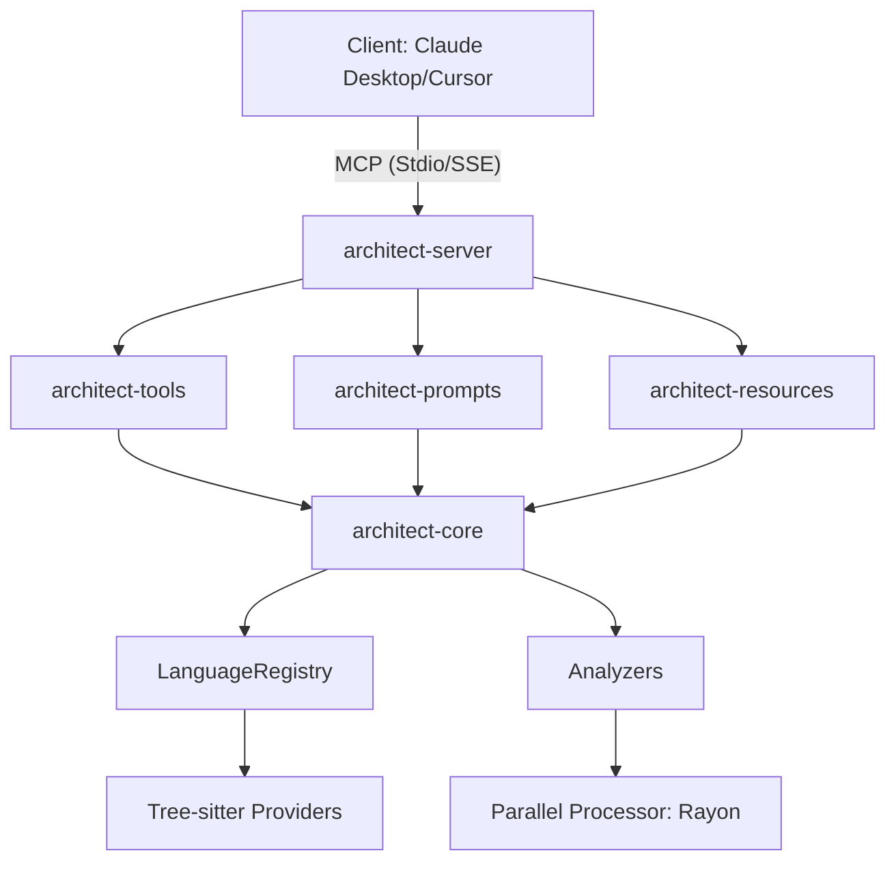

# 🏗️ Architect MCP (Model Context Protocol)

Architect MCP is a professional-grade static analysis server built on the Model Context Protocol. It is specifically designed for **Software Architects, Senior Engineers, and AI Agents** to understand, visualize, and govern complex codebases across multiple programming languages.

Using **Tree-sitter** for deep AST analysis and **Rayon** for high-performance parallel processing, Architect MCP provides architectural insights that go far beyond simple text searching.

---

## 🌟 Key Features

- **Decoupled Plugin Architecture**: Support for 11+ languages with a modular provider system.
- **Parallel Analysis Engine**: High-performance multi-core scanning for large-scale monorepos.
- **Language-Agnostic Core**: Unified logic for metrics, dependencies, and impact analysis.
- **AI Context Optimization**: Smart filtering of symbols (Blast Radius) to stay within LLM token limits.
- **Architectural Governance**: Define and enforce layer boundaries and circular dependency rules via JSON.
- **Cloud Ready**: Native support for **SSE (Server-Sent Events)** for deployment on platforms like Fly.io or Railway.

---

## 📂 Supported Languages (11)

| System | Backend/General | Mobile/Web |
|---|---|---|
| Rust, C, C++ | Python, Java, Go, Ruby, PHP, Kotlin | JavaScript, TypeScript |

---

## 🛠️ MCP Tool Suite

Architect MCP exposes a powerful suite of tools to your MCP client:

### 📊 Overview & Metrics
- **`summarize_project_structure`**: High-level overview of language distribution and patterns.
- **`analyze_metrics`**: Calculates **Cyclomatic Complexity** and LoC.
- **`analyze_test_gap`**: Identifies high-complexity functions lacking tests.

### 🔗 Dependency & Impact
- **`analyze_call_graph`**: Builds a complete map of function calls across the workspace.
- **`analyze_dependencies`**: Maps file-level import/include relationships.
- **`analyze_blast_radius`**: Integrated impact analysis for symbols and files.
- **`analyze_external_coupling`**: Measures depth of 3rd-party library penetration.
- **`analyze_outbound_calls`**: Maps external system interactions (HTTP/gRPC/DB).

### 🛡️ Governance & Quality
- **`lint_architecture`**: Enforces layer boundaries and detects circular dependencies.
- **`find_dead_code`**: Identifies unused functions and symbols.
- **`scan_security_hotspots`**: Scans for `eval()`, `unsafe`, and other dangerous patterns.
- **`audit_error_handling`**: Audits for anti-patterns like swallowed exceptions.

### 🤖 AI Specific
- **`request_refactor_suggestion`**: AI-driven architectural advice based on the current context.

---

## 💡 Advanced AI Capabilities: Prompts & Resources

Architect MCP provides specialized **Prompts** and **Resources** to interact with AI agents more effectively.

### 🎭 Specialized Prompts
- **`architect-review`**: Guides the AI to perform a detailed architectural review of a specific function.
- **`architect-refactor-suggestion`**: Instructs the AI to analyze "Hell Functions" and propose a refactoring roadmap.
- **`architect-security-audit`**: Deep security audit using detected hotspots and API extraction.

### 🌐 Live Resources
- **`architect://call-graph/summary`**: Current workspace call graph data.
- **`architect://visual/mermaid`**: Dynamic **Mermaid.js** diagram of call relationships.
- **`architect://metrics/debt`**: Live technical debt reports.
- **`architect://analysis/dead-code`**: List of unused symbols.
- **`architect://analysis/structure`**: Project architecture summary.
- **`architect://analysis/security`**: Live security hotspot feed.

---

## 📐 Internal Architecture



---

## 🚀 Getting Started

### Prerequisites
- [Rust](https://www.rust-lang.org/) (latest stable version)
- Or [Docker](https://www.docker.com/)

### Installation & Local Run
1. **Clone & Build**:
   ```bash
   git clone https://github.com/sjkim1127/Architect_MCP.git
   cd Architect_MCP
   cargo build --release
   ```
2. **Configure Client**:
   Add to `claude_desktop_config.json`:
   ```json
   {
     "mcpServers": {
       "architect": {
         "command": "/path/to/Architect_MCP/target/release/architect-server"
       }
     }
   }
   ```

---

## 🐳 Docker & Cloud Deployment

Architect MCP is container-ready for cloud deployment.

### 1. Build Docker Image
```bash
docker build -t architect-mcp .
```

### 2. Run as SSE Server (Cloud/HTTP)
```bash
docker run -p 3000:3000 \
  -e MCP_TRANSPORT=sse \
  -e PORT=3000 \
  architect-mcp
```

### 3. Environment Variables
| Variable | Description | Default |
|---|---|---|
| `MCP_TRANSPORT` | Transport mode (`stdio` or `sse`) | `stdio` |
| `PORT` | HTTP port for SSE mode | `3000` |
| `RUST_LOG` | Logging level (`info`, `debug`, `trace`) | `info` |

---

## 🧪 CI/CD
Automated pipelines ensure quality on every push:
- **Lint & Format**: Automated `clippy` and `rustfmt`.
- **Build & Test**: Full workspace validation on Linux/Mac.

---

## 📄 License
This project is licensed under the MIT License.
